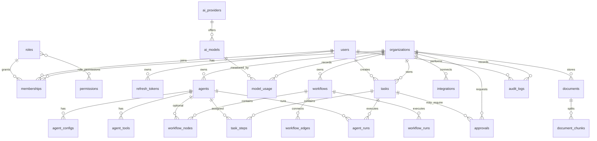

# SYLQENTRA ERD (Phase 03)

화살표는 외래 키가 가리키는 부모 테이블이다. 조직에 직접 연결된 테이블은 `organization_id`로 회사 데이터를 분리한다.

```mermaid
erDiagram
    organizations ||--o{ memberships : has
    users ||--o{ memberships : joins
    roles ||--o{ memberships : grants
    roles }o--o{ permissions : role_permissions
    users ||--o{ refresh_tokens : owns

    organizations ||--o{ agents : owns
    agents ||--o{ agent_configs : has
    agents ||--o{ agent_tools : has
    ai_providers ||--o{ ai_models : offers
    organizations ||--o{ model_usage : records
    ai_models ||--o{ model_usage : measured_by

    organizations ||--o{ tasks : owns
    users ||--o{ tasks : creates
    tasks ||--o{ task_steps : contains
    agents ||--o{ task_steps : assigned
    tasks ||--o{ agent_runs : executes
    agents ||--o{ agent_runs : runs

    organizations ||--o{ workflows : owns
    workflows ||--o{ workflow_nodes : contains
    workflows ||--o{ workflow_edges : connects
    workflows ||--o{ workflow_runs : executes
    agents ||--o{ workflow_nodes : optional

    organizations ||--o{ approvals : requests
    tasks ||--o{ approvals : may_require
    organizations ||--o{ integrations : connects
    organizations ||--o{ documents : stores
    documents ||--o{ document_chunks : splits
    organizations ||--o{ audit_logs : records
    users ||--o{ audit_logs : performs
```

`document_chunks.embedding`은 아직 JSON이다. Phase 10에서 pgvector 컬럼으로 바꾼다.
